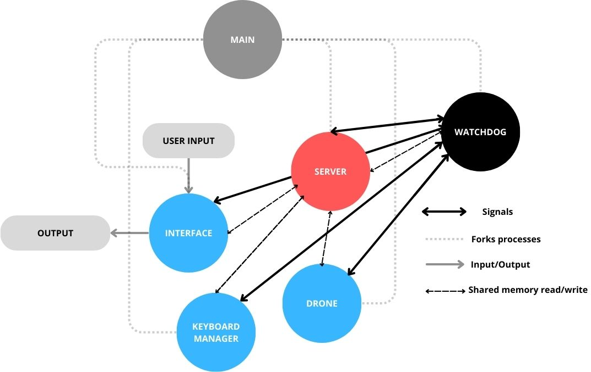

# Assignment 2
This assignment represents the first part of the project for Advanced and Robot Programming course on UniGe in the winter semester 2023/2024. 

The work has been performed by a team of two: Josue Tinoco and Michał Krępa *coolGoose*

## Installation & Usage
For project's configuration we have used `Makefile`.

To build executables simply hit:
```
make
```
in the project directory.

To run the game hit:
```
make run
```
when this happens a 5 windows with konsole processes will launch, each one for different segment.

To remove the executables simply hit 
```
make clean
```

### Operational instructions, controls
To operate the drone use following keybindings

    `q` `w` `e`       
    
    `a` `s` `d`    
    
    `z` `x` `c`       
    

The given bindings represent 8 different directions for the drone movement.
- `w` : UP
- `x` : DOWN
- `a` : LEFT
- `d` : RIGHT

- `q` : UP-LEFT
- `e` : UP-RIGHT
- `z` : DOWN-LEFT
- `c` : DOWN- RIGHT

The center key `s` is used to STOP all forces on the drone. However, because the drone physics has been programed with inertia, it will keep moving for a short time before completely stopping.

## Overview 



The first part assumes first 6 components:
- Main
- Server (blackboard using Pipes)
- Window (User interface)
- Keyboard Manager
- Drone
- Targets
- Obstacles
- Watchdog
- Logger

For further details on all of the above mentioned components. please refer to the description below.

### Main
Main process is the father of all processes. It creates child processes by using `fork()` and runs them inside a wrapper program `Konsole` to display the current status, debugging messages until an additional thread/process for colleceting log messages.

Every pipe for use in the program is created using `pipe()`, and each of the file descriptors are passed to the arguments of the processes created. The read or write end of each pipe is assigned to exclusively one process.

After creating children, process stays in a infinite while loop awaiting termination of all processes, and when that happens - it terminates itself.

### Server
Server process is the heart of this project. It manages all communications regarding pipes amongst all processes, so that when it reads the data, it is able to send it to the correct recipients. This is done in a controlled infinite loop that will terminate depending on the watchdog control of the program.

When necessary, the server may read the contents of each data received in order to understand the appropiate destination for it. This way, each of the processes will only read specific data intended for them. 


### Watchdog - Turned off
**REMARK**: This process generated a lot of unstabilities that we couldnt solve in time, therefore we decided not to use it in this assignment. 
Watchdog's job is to monitor the "health" of all of the processes, which means at this point if processes are running and not closed.

During initialization it gets from special shared memory segment the PIDs of processes, (remember that in main we are running the wrapper process Konsole, so its not possible to get to know the actual PID from `fork()` in `main`, at this point at least).

Then the process enters while loop where it sends `SIGUSR1` to all of the processes checking if they are alive. They respond with `SIGUSR2` back to watchdog, knowing its PID thanks to `siginfo_t`. This zeroes the counter for programs to response. If the counter for any of them reaches the threshold, Watchdog sends `SIGINT` to all of the processes, and exits, making sure all of the semaphores it was using are closed. The same thing happens when Watchdog is interrupted.

### Interface (Window)
The interface process handles user interaction within the `Konsole` program by creating a graphical environment. This environment is designed to receive user inputs, represented by key presses, and subsequently display the updated state of the program.

To initiate this process, the necessary signals are initialized, and pipes file descriptors are obtained, setting the groundwork for execution. The interface will receive data exclusively from the server, for which its origin are the drone, targets and obstacles processes.

The ncurses library is utilized to build the graphical interface. The program first employs the `initscr()` function, then the terminal dimensions are captured using `getmaxyx()`, and a box is drawn around the interface using `box()`. The initial drone position is set at the center of this box, representing the boundaries of the functional area within which the drone can navigate freely.

Afterwards the program enters an infinite loop, continuously monitoring user key presses with the help of `getch()`. Simultaneously, it updates the drone's position with `mvaddch()` on the screen whenever a movement action presents itself. This ensures real-time user interaction and visualization of the drone's movements.

This process also handles logic regarding the current state of the game, for which it continuosly analyzes the position of the drone, targets and obstacles in order to calculate a score that will be updated on the screen for the player to see.

### Keyboard manager
The keyboard manager process serves as the bridge between the interface and the computation of the drone's movements. It retrieves the key pressed by the user from shared memory and subsequently translates them into integer values representing the force applied in each possible direction, which are then communicated to the drone's process.

Within an infinite while loop, the iteration time is controlled through a `do_while`, in which the function `select()` is used inside of it, to wait for the readiness of the pipe to allow execution of the rest of the code. The specific action to be taken is determined by a function containing multiple `if` statements. Based on these conditions, values are assigned to variables x or y, which represent movement along the horizontal or vertical axis within the window. Three possible values `[-1, 0, 1]` are sent, indicating the magnitude and direction of movement, while any other value outside this range would indicate a special non-movement action understood by the drone process.

### Drone
The drone process is the one responsable for the drone's physics, movement, boundaries and conditional events within the interface working area (window). It ensures the drone behaves and moves correctly on the window drawn by the interface, for which physical equations have been computed to simulate movement withing certain pre-defined parameters. At the same time, the drone interacts with external elements (targets and obstacles) which exert additional forces that procide a more dynamic control for it.

Multiples variables are defined such as position, velocity, force and accelerationn. It only requires from the interface the initial position values where it drew the drone on the screen. From then onwards, it is this process alone that will determine all future positions for the drone.

Inside the main loop, no special functions are used besides the ones needed for reading or writing data to the server. In order to move the drone trough the screen, the `euler method` is the default choice at the beginning of the program, contains the drone dynamic formulas which make the drone move with inertia and viscous resistance. For the external forces, Kathib’s model was used to compute a formula to obtain both the repulsion and attraction forces acting up on the drone

### Targets
The targets process requires to read from the server the screen dimensions of the window. Once they are obtained, the logic for creating the target is executed once and inmediately sent. If the window is resized, the interface process will be the one to re-scale the coordinates.

The targets position on the screen is calculated in a combination of randomness and order. Six sections for any given area are generated, so while the coordinates of the targets make use of the `rand()` function, they are still placed in a way so that they are distributed evenly alongside those sections. This way the player will never get entire targetless sections, making efficient use of all the window.

### Obstacles
The obstacles process also requires before the main loop to obtain the screen dimensions of the window. There are multiple key difference regarding how these are spawned, in comparison with the targets.

At first, they are truly randomly generated throughout the entirety of the screen. Second, because the obstacles appear and dissapear at random intervals, it never stops sendind data to the server, updating the new coordinates for each obstacle. Many pre-defined variables directly affect the behavior of the creation of targets, which mostly relate to the minimun and maximum time they will appear on the screen, or the rate at which they are generated.

### Logger - has issues
Logger uses shared memory segment for getting the messages and writing them into a txt file with a timestamp of the session. **REMARK**: At this level this process has some issues that lead to the crash, that we couldn't solve for a while. Therefore we do not include the logger in the main run of the whole game.


### Further work
- [ ] Rework of pipes to go back to shared memory
- [ ] Solve issues regarding Watchdog and Logger
- [ ] Improvement of the monitoring and logging processes
- [ ] Use of sockets for communication with an external server

